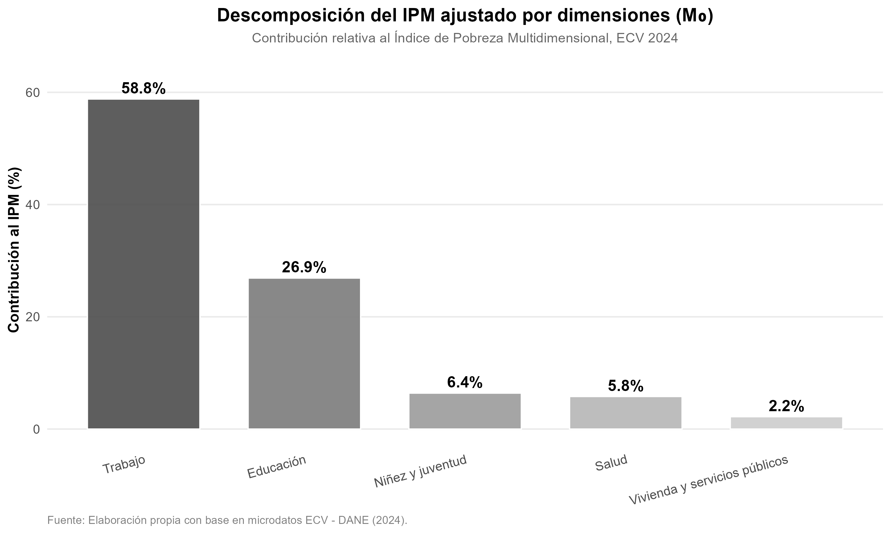
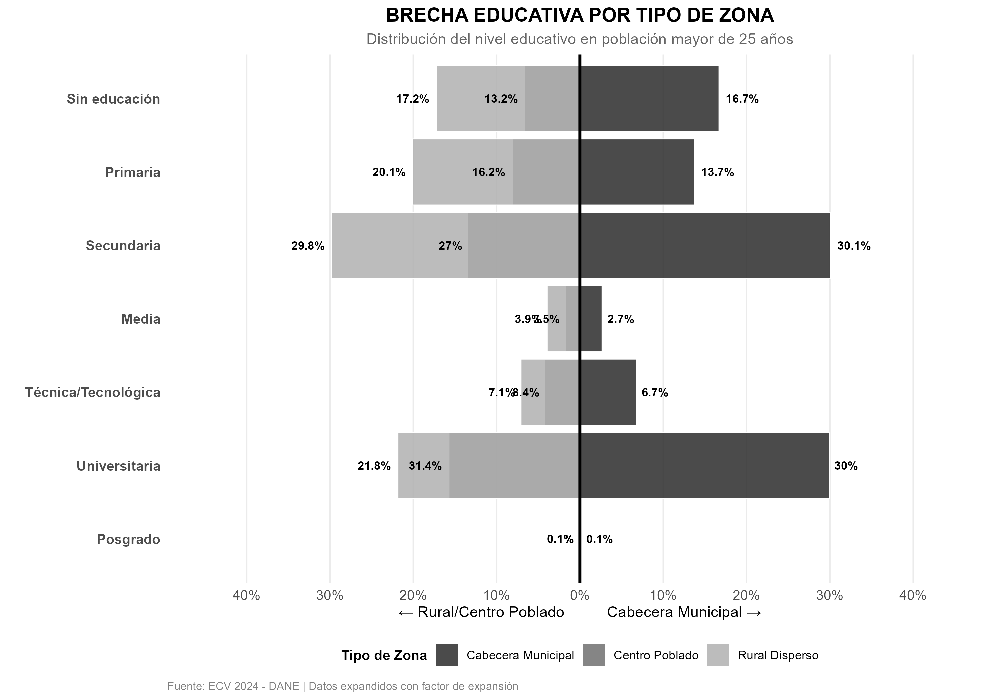

<p align="center">
  
</p>

<h1 align="center">
  Cálculo del Índice de Pobreza Multidimensional (IPM) – Algoritmo Oficial del DANE
</h1>

<p align="center">
  <b>Economía · Econometría · Estadística Aplicada</b>
</p>

---

## 📑 Tabla de Contenidos
- [Acerca del Proyecto](#acerca-del-proyecto)
- [Estructura del Repositorio](#estructura-del-repositorio)
- [Descripción del Algoritmo](#descripción-del-algoritmo)
- [Requisitos del Entorno](#requisitos-del-entorno)
- [Cómo Ejecutar el Script](#cómo-ejecutar-el-script)
- [Figuras Incluidas](#figuras-incluidas)
- [Licencia y Uso de Datos](#licencia-y-uso-de-datos)
- [Autor](#autor)

---

## Acerca del Proyecto

Este repositorio contiene la implementación del **algoritmo oficial del DANE** para el cálculo del **Índice de Pobreza Multidimensional (IPM)** de Colombia, basado en la metodología de Alkire-Foster. El script está desarrollado en R y reproduce fielmente el procedimiento utilizado para generar las estadísticas oficiales de pobreza multidimensional del país.

El IPM es una medida que va más allá del ingreso monetario y captura las múltiples privaciones que enfrentan los hogares colombianos en cinco dimensiones fundamentales: condiciones educativas del hogar, condiciones de la niñez y juventud, salud, trabajo, y acceso a servicios públicos domiciliarios y condiciones de la vivienda.

### Propósito Académico

Este repositorio tiene como objetivo:

- Proporcionar una implementación transparente y reproducible del cálculo oficial del IPM
- Servir como material de apoyo para cursos de econometría y estadística aplicada
- Facilitar la investigación académica en temas de pobreza multidimensional
- Permitir la validación y comparación de resultados con cifras oficiales
- Contribuir a la comprensión metodológica del enfoque de Alkire-Foster

El proyecto forma parte del trabajo académico desarrollado en el programa de Economía de la Universidad Nacional de Colombia, con énfasis en análisis aplicado de políticas públicas y medición de pobreza.

---

## Estructura del Repositorio
```
Repositorio_Calculo_IPM/
│
├── 01_Scripts/
│   └── Algoritmo_DANE_IPM.R
│
├── 02_Figuras/
│   ├── 03_descomposicion_ipm_barras.png
│   └── brecha_educativa_zonas.png
│
└── README.md
```

**Descripción de componentes:**

- `01_Scripts/`: Contiene el script principal con el algoritmo completo del DANE
- `02_Figuras/`: Visualizaciones derivadas del análisis del IPM
- `README.md`: Documentación del proyecto

---

## Descripción del Algoritmo

El script `Algoritmo_DANE_IPM.R` implementa de manera secuencial y documentada el procedimiento oficial para el cálculo del IPM, siguiendo estos pasos:

### 1. Preparación de datos

- Lectura de microdatos de la Encuesta de Calidad de Vida (ECV)
- Estandarización de variables clave
- Construcción de identificadores únicos de hogar

### 2. Identificación de privaciones

El algoritmo evalúa 15 indicadores de privación organizados en 5 dimensiones, con sus respectivas ponderaciones:

**Condiciones educativas del hogar (20%)**
- Bajo logro educativo (10%)
- Analfabetismo (10%)

**Condiciones de la niñez y juventud (20%)**
- Inasistencia escolar (5%)
- Rezago escolar (5%)
- Barreras de acceso a servicios para el cuidado de la primera infancia (5%)
- Trabajo infantil (5%)

**Salud (20%)**
- Sin aseguramiento en salud (10%)
- Barreras de acceso a servicios de salud (10%)

**Trabajo (20%)**
- Desempleo de larga duración (10%)
- Empleo informal (10%)

**Acceso a servicios públicos domiciliarios y condiciones de la vivienda (20%)**
- Sin acceso a fuente de agua mejorada (4%)
- Inadecuada eliminación de excretas (4%)
- Material inadecuado de pisos (4%)
- Material inadecuado de paredes exteriores (4%)
- Hacinamiento crítico (4%)

### 3. Aplicación del método Alkire-Foster

El método identifica hogares pobres multidimensionales mediante un criterio dual:

1. **Cálculo del puntaje de privaciones (ci)**: Suma ponderada de las privaciones que experimenta cada hogar
2. **Aplicación del umbral de pobreza (k=33.33%)**: Un hogar se considera pobre multidimensional si su puntaje de privaciones supera el 33.33%

### 4. Construcción de indicadores agregados

- **H (Incidencia)**: Proporción de hogares pobres multidimensionales
- **A (Intensidad promedio)**: Promedio del puntaje de privaciones entre los hogares pobres
- **IPM (Índice de Pobreza Multidimensional)**: Producto ajustado H × A

### 5. Generación de outputs

El script produce:
- Variables binarias de privación para cada indicador
- Puntaje de privaciones por hogar
- Identificación de pobreza multidimensional
- Indicadores H, A e IPM desagregados por zona (urbano/rural)
- Tablas de frecuencia y estadísticas descriptivas

Este algoritmo reproduce exactamente la metodología oficial empleada por el DANE para la publicación de las cifras nacionales del IPM.

---

## Requisitos del Entorno

### Software necesario

- **R** versión ≥ 4.0.0
- **RStudio** (recomendado para facilitar la ejecución)

### Paquetes de R
```r
# Manejo y transformación de datos
library(tidyverse)
library(dplyr)
library(readr)

# Para instalación de paquetes faltantes
install.packages("tidyverse")
install.packages("dplyr")
install.packages("readr")
```

### Datos requeridos

Los microdatos de la **Encuesta de Calidad de Vida (ECV)** deben descargarse desde el portal oficial del DANE:
- URL: [https://www.dane.gov.co/](https://www.dane.gov.co/)
- Sección: Microdatos → Encuesta de Calidad de Vida
- Formato: Archivos .sav (SPSS) o .dta (Stata)

**Nota importante:** Los microdatos no están incluidos en este repositorio por políticas de protección de datos del DANE. Cada usuario debe descargarlos directamente de la fuente oficial.

---

## Cómo Ejecutar el Script

### Paso 1: Descargar microdatos

1. Accede al [portal de microdatos del DANE](https://www.dane.gov.co/)
2. Descarga los módulos de la ECV correspondientes al año de interés
3. Guarda los archivos en una carpeta local de tu preferencia

### Paso 2: Configurar ruta de datos

Abre el archivo `01_Scripts/Algoritmo_DANE_IPM.R` y modifica la ruta de acceso a los datos:
```r
# Ejemplo de configuración de ruta
ruta_datos <- "C:/Users/TuUsuario/Documentos/ECV_2024/"

# O en sistemas Unix/Mac
ruta_datos <- "/Users/TuUsuario/Documentos/ECV_2024/"
```

### Paso 3: Ejecutar el script

Desde R o RStudio, ejecuta:
```r
source("01_Scripts/Algoritmo_DANE_IPM.R")
```

O abre el archivo en RStudio y presiona `Ctrl + Shift + Enter` (o `Cmd + Shift + Enter` en Mac).

### Paso 4: Resultados generados

El script generará automáticamente:

- **Variables de privación** para cada uno de los 15 indicadores
- **Puntaje de privaciones** por hogar (ci)
- **Indicador de pobreza multidimensional** (variable binaria)
- **Índices agregados**: H, A e IPM
- **Tablas de salida** con resultados desagregados
- **Figuras** (si están activadas las secciones de visualización)

Los resultados pueden exportarse fácilmente modificando las últimas líneas del script para guardar archivos .csv o .xlsx.

---

## Figuras Incluidas

### Descomposición del IPM por dimensión



**Descripción:** Esta figura presenta la contribución relativa de cada una de las cinco dimensiones del IPM al índice total. El gráfico de barras permite identificar cuáles privaciones tienen mayor peso en la pobreza multidimensional del país, facilitando la priorización de políticas públicas. Se observa la importancia relativa de educación, salud, trabajo, condiciones de vivienda y situación de la niñez y juventud.

---

### Brecha educativa por zonas



**Descripción:** Pirámide educativa comparativa que muestra la distribución de niveles educativos alcanzados por la población en zonas urbanas versus rurales. La visualización permite identificar disparidades significativas en el acceso y logro educativo según área geográfica, evidenciando las brechas estructurales que contribuyen a la pobreza multidimensional en el contexto colombiano. Se desagrega por grupos de edad para analizar la evolución generacional del acceso educativo.

---

**Nota técnica:** Todas las figuras están en formato PNG de alta resolución y han sido generadas utilizando el paquete `ggplot2` de R. Son reproducibles ejecutando las secciones correspondientes del script principal.

---

## Licencia y Uso de Datos

### Código

El código contenido en este repositorio es de **uso académico libre**. Se permite su utilización, modificación y distribución para fines educativos y de investigación, siempre que se realice la debida atribución al autor.

### Microdatos

Los microdatos de la Encuesta de Calidad de Vida (ECV) son propiedad del **Departamento Administrativo Nacional de Estadística (DANE)** de Colombia y están sujetos a sus políticas de protección y confidencialidad.

- Los microdatos **no están incluidos** en este repositorio
- Deben descargarse directamente desde el [portal oficial del DANE](https://www.dane.gov.co/)
- Su uso debe respetar los términos y condiciones establecidos por el DANE
- Está prohibido el uso de microdatos para fines comerciales sin autorización expresa
- Se debe garantizar la confidencialidad de la información de los hogares encuestados

### Metodología IPM

La metodología del Índice de Pobreza Multidimensional es pública y está documentada en los informes técnicos del DANE. Este repositorio implementa dicha metodología con fines exclusivamente académicos y de transparencia metodológica.

### Citación sugerida

Si utilizas este código en tu investigación o trabajo académico, por favor cita:
```
Meza García, J. S. (2024). Cálculo del Índice de Pobreza Multidimensional (IPM) – 
Algoritmo Oficial del DANE. GitHub. https://github.com/jmeza-data/Repositorio_Calculo_IPM
```

Para citar la metodología oficial del IPM, consulta las publicaciones del DANE disponibles en su portal web.

---

## Autor

**Jhoan Sebastián Meza García**  
Estudiante de Economía  
Universidad Nacional de Colombia

**Áreas de enfoque:**
- Pobreza multidimensional y políticas públicas
- Estadística aplicada y econometría
- Análisis de encuestas de hogares
- Evaluación de programas sociales

**Contacto:**  
📧 GitHub: [jmeza-data](https://github.com/jmeza-data)

---

<p align="center">
  <i>Desarrollado con fines académicos y de investigación aplicada<br>
  Universidad Nacional de Colombia · 2024</i>
</p>
